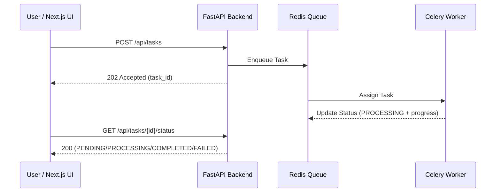

# Async Task Dashboard ⚡️📊

> **Learning / demo project.** The async plumbing (FastAPI → Redis queue → Celery worker → polling) is real and runnable. The "business calculation" inside the worker (`run_heavy_simulation`) is a simulated placeholder that sleeps and returns a fixed sample result — it does not compute anything real. Treat this repo as a demonstration of the async task pattern, not of the analysis itself.

A Full Stack project built to demonstrate asynchronous architecture with robust UX:
- **Frontend:** Next.js 14 + TypeScript + Tailwind
- **API:** FastAPI
- **Worker:** Celery
- **Broker/Result Backend:** Redis

## Key Concepts Demonstrated
- How to prevent blocking the UI during long-running tasks.
- Proper API design for asynchronous operations (`202 Accepted` on task creation).
- Resilient polling mechanism with strict typing and comprehensive state management.
- Clean separation of concerns between transport (FastAPI) and execution (Celery).

## Architecture

## Managed States
- `PENDING`
- `PROCESSING`
- `COMPLETED`
- `FAILED`
- Network timeouts on the frontend (handled via AbortController)

## Endpoints
- `POST /api/tasks`
  - Creates an asynchronous task.
  - Response: `202 Accepted`
- `GET /api/tasks/{task_id}/status`
  - Returns the current status and progress of the task.
  - Response: `404 Not Found` if the `task_id` does not exist.

## Local Setup
\`\`\`bash
# 1. Clone the repository
git clone https://github.com/sergioballesteros-vd/async-task-dashboard.git
cd async-task-dashboard

# 2. Start the Full Stack environment via Docker Compose
docker-compose up --build
\`\`\`

Wait for the services to build and start. The frontend will be available at `http://localhost:3000` and the API at `http://localhost:8000/docs`.

## Future Enhancements
- Add a button to simulate a controlled worker failure.
- Add duration metrics per task.
- Implement WebSocket/SSE support to compare against the polling strategy.
