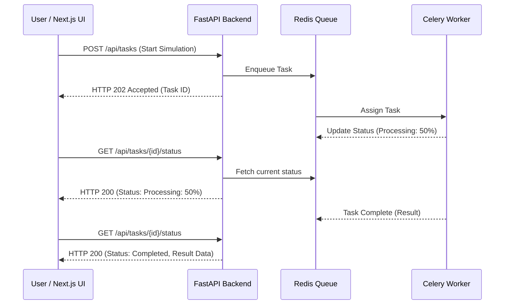

# Async Task Dashboard ⚡️📊

A Full Stack solution demonstrating how to elegantly handle long-running, resource-intensive background tasks (like complex simulations or heavy data processing) without blocking the user interface.

## The Problem
Standard HTTP requests time out or provide terrible UX when a backend process takes more than a few seconds. Users are left looking at a frozen loading spinner, unsure if the system crashed.

## The Solution
An asynchronous architecture where the backend instantly acknowledges the request and offloads the work to a distributed task queue. The frontend gracefully polls (or uses WebSockets) to update the UI in real-time as the task progresses through its lifecycle (Pending -> Processing -> Completed/Failed).

## Architecture

## Key Technologies & Design Principles
- **Frontend (Next.js 14 & TypeScript):** 
  - Custom React Hooks to encapsulate polling logic, adhering to the **Single Responsibility Principle (SRP)**.
  - Tailwind CSS for modular, utility-first styling.
- **Backend (Python FastAPI):** 
  - Lightweight, non-blocking routing. 
  - **Interface Segregation:** API endpoints only know how to enqueue tasks and read statuses, completely decoupled from the actual processing logic.
- **Workers (Celery & Redis):** Robust task execution with idempotency and retry mechanisms built-in.

## Local Setup
\`\`\`bash
# 1. Clone the repository
git clone https://github.com/yourusername/async-task-dashboard.git
cd async-task-dashboard

# 2. Start the Full Stack environment via Docker Compose
docker-compose up --build
\`\`\`
