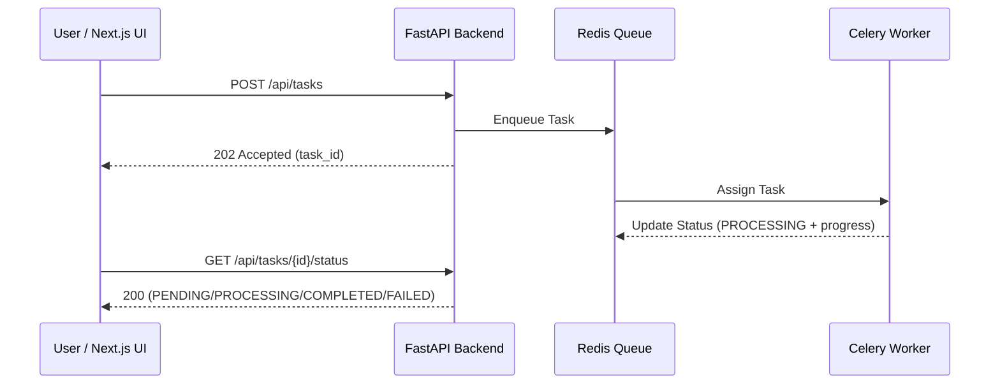

# Async Task Dashboard ⚡️📊

Proyecto Full Stack diseñado como **escaparate para LinkedIn** para demostrar arquitectura asíncrona real con UX robusta:
- Frontend: Next.js 14 + TypeScript + Tailwind
- API: FastAPI
- Worker: Celery
- Broker/Result Backend: Redis

## Qué demuestra este proyecto
- Cómo evitar bloquear la UI con tareas largas.
- Diseño API correcto para asincronía (`202 Accepted` al crear tarea).
- Polling resiliente con tipado estricto y gestión de estados completos.
- Separación limpia entre transporte (FastAPI) y ejecución (Celery).

## Arquitectura

## Estados gestionados
- `PENDING`
- `PROCESSING`
- `COMPLETED`
- `FAILED`
- Timeout de red en frontend (AbortController)

## Endpoints
- `POST /api/tasks`
  - Crea tarea asíncrona
  - Respuesta: `202 Accepted`
- `GET /api/tasks/{task_id}/status`
  - Devuelve estado y progreso
  - Respuesta: `404 Not Found` si el `task_id` no existe

## Local Setup
\`\`\`bash
# 1. Clone the repository
git clone https://github.com/yourusername/async-task-dashboard.git
cd async-task-dashboard

# 2. Start the Full Stack environment via Docker Compose
docker-compose up --build
\`\`\`

Wait for the services to build and start. The frontend will be available at `http://localhost:3000` and the API at `http://localhost:8000/docs`.

## Ideas para destacar más en LinkedIn
- Añadir botón para simular fallo controlado del worker.
- Añadir métricas de duración por tarea.
- Añadir modo WebSocket/SSE para comparar con polling.
